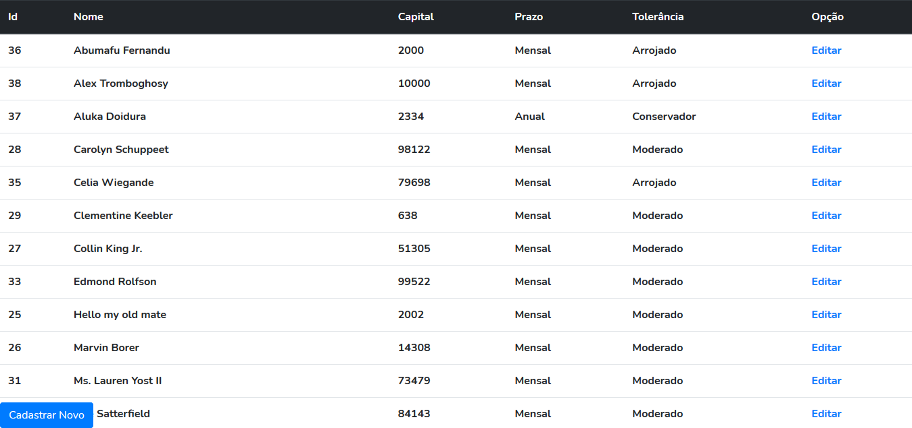
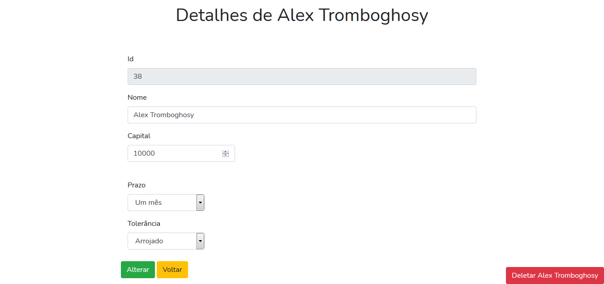

<!-- Título&Descrição -->
<h1 align="center" id="title">Invista Já</h1>
<p align="center">Este é um website bastante simples focado apenas em um CRUD (Create, Read, Update, Delete), desenvolvido na faculdade para exercitar o conhecimento no mesmo. Foi elaborado com o framework Laravel, utilizado o tema de investimentos financeiros. Sendo assim, lembre-se que a abordagem ao tema foi muito superficial e rasa.</p>

<!-- Estado da aplicação -->
<h4 align="center"> 
    Status: Finalizado! :heavy_check_mark:
</h4>

<!-- Menu -->
<p align="center">
	<a href="#screenshots">Screenshots</a> • 
	<a href="#tecnologias">Tecnologias</a> • 
	<a href="#features">Features</a> •
	<a href="#pre">Pré-Requisitos</a> • 
	<a href="#run">Rodando a aplicação</a> • 
	<a href="#autor">Autor</a>
</p>
<!-- Shield -->
<p>
	</img>
	</img>
</p>

<!-- Screenshots -->
<h2 align="left" id="screenshots">Screenshots</h2>
<p align="center">
  
</p>
<p align="center">
  
</p>
<p align="center">
  
</p>

<!-- Features -->
<h2 align="left" id="tecnologias">Tecnologias</h2>

As seguintes ferramentas foram usadas na construção do projeto:

- [PHP](https://www.php.net/)
- [Laravel](https://laravel.com/)
- [Composer](https://getcomposer.org/)

<!-- Features -->
<h2 align="left" id="features">Features</h2>

- [x] Cadastro do investidor;
- [x] Listagem de investidores;
- [x] Alteração do investidor;
- [x] Exclusão do investidor;

<!-- Pré-Requisitos -->
<h2 align="left" id="pre">Pré-Requisitos</h2>

Antes de começar, você vai precisar ter instalado em sua máquina as seguintes ferramentas:
[PHP](https://www.php.net/), [Laravel](https://laravel.com/) e o [Composer](https://getcomposer.org/). É bacana você possuir um editor para trabalhar com o código, fica a dica o [VSCode](https://code.visualstudio.com/).

<!-- Executando o app -->
<h2 align="left" id="run">Rodando a aplicação (web)</h2>

```bash
# Clone este repositório
# Exemplo em Https
$ git clone https://github.com/IN0C3NC10/Invista_Ja.git

# Abra a pasta no seu VSCode ou editor de preferência
# Altere as configurações no arquivo .env de acordo com o banco de dados de sua escolha

# Use o seguinte comando no CMD/PowerShell para criação das tabelas
$ php artisan migrate

# Depois, use o seguinte comando no CMD/PowerShell para criação das factories
$ php artisan db:seed --class=DatabaseSeeder

# Utilize o seguinte comando no CMD/PowerShell para iniciar o projeto
$ php artisan serve

#Seja Feliz!
```
<!-- Autor -->
<h2 align="left" id="autor">Autor</h2>
<p>
	<a href="https://github.com/IN0C3NC10">
		
	</a>
	<br />
	Feito com ❤️ por <strong>Bruno Inocencio</strong>!
</p>

<p align="left">
  <!-- Outlook -->
  <a href="mailto:bruno.inocencio@fatec.sp.gov.br" alt="Outlook" target="_blank">
    
  </a>
  <!-- Linkedin -->
  <a href="https://cutt.ly/nQlVjQV" alt="Linkedin" target="_blank">
    
  </a>
  <!-- GitHub -->
  <a href="https://github.com/IN0C3NC10" alt="GitHub" target="_blank">
    
  </a>
</p>
